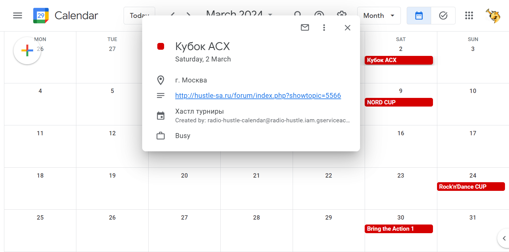

# Описание
Утилита для синхронизация календаря турниров с 
[Radio Hustle](https://app.radiohustle.online/#/calendar)
с Google Календарём.



# Использование

Вызов синхронизации:

```
radio_hustle_calendar <google-calendar-id> --credentials=<file-with-google-service-account>
```

Для работы утилите необходимы:
1. Google Service Account, у которого есть доступ к Google Calendar
2. ID Google календаря, с которым будет синхронизироваться 
список турнирова с Radio Hustle.

Данные с турнирами от Radio Hustle доступны по публичному URL,
дополнительных действий не требуется.

Утилита имеет команды для работы с Google календарями:

```
radio_hustle_calendar calendar list --credentials=<file-with-google-service-account>
radio_hustle_calendar calendar create --credentials=<file-with-google-service-account>
radio_hustle_calendar calendar del --credentials=<file-with-google-service-account>
```
